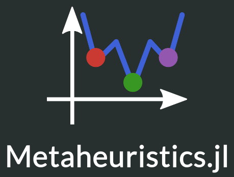

# Metaheuristics




High performance metaheuristics for global optimization.


[](https://app.travis-ci.com/jmejia8/Metaheuristics.jl)
[](https://codecov.io/gh/jmejia8/Metaheuristics.jl)
[](https://jmejia8.github.io/Metaheuristics.jl/stable/)
[](https://jmejia8.github.io/Metaheuristics.jl/dev/)
[](https://zenodo.org/badge/latestdoi/108706706)


## Installation

Open the Julia (Julia 1.1 or later) REPL and press `]` to open the Pkg prompt. To add this package, use the add command:

```
pkg> add Metaheuristics
```

Or, equivalently, via the `Pkg` API:

```julia
julia> import Pkg; Pkg.add("Metaheuristics")
```


## Algorithms

Some representative metaheuristics are developed here, including those for single- and
multi-objective optimization. Moreover, some constraint handling techniques have been
considered in most of the implemented algorithms.

### Single-Objective Optimization

- **ECA**: Evolutionary Centers Algorithm
- **DE**:  Differential Evolution
- **PSO**: Particle Swarm Optimization
- **ABC**: Artificial Bee Colony
- **GSA**: Gravitational Search Algorithm
- **SA**:  Simulated Annealing
- **WOA**: Whale Optimization Algorithm
- **MCCGA**: Machine-coded Compact Genetic Algorithm

### Multi-Objective Optimization

[](https://jmejia8.github.io/Metaheuristics.jl/stable/visualization/)

- **MOEA/D-DE**: Multi-objective Evolutionary Algorithm based on Decomposition
- **NSGA-II**:  A fast and elitist multi-objective genetic algorithm: NSGA-II
- **NSGA-III**: Evolutionary Many-Objective Optimization Algorithm Using Reference-Point-Based
  Nondominated Sorting Approach
- **SMS-EMOA**: An EMO algorithm using the hypervolume measure as selection criterion
- **SPEA2**: Improved Strength Pareto Evolutionary Algorithm

## Performance Indicators


- **GD**: Generational Distance
- **IGD, IGD+**: Inverted Generational Distance (Plus)
- **C-metric**: Covering Indicator
- **HV**: Hypervolume
- **Δₚ** (Delta p): Averaged Hausdorff distance
- Spacing Indicator
- [and more...](https://jmejia8.github.io/Metaheuristics.jl/stable/indicators/)


## Quick Start

Assume you want to solve the following minimization problem.


Minimize:

%20=%2010D%20+%20\sum_{i=1}^{D}%20%20x_i^2%20-%2010\cos(2\pi%20x_i))

where , i.e.,  for . D is the
dimension number, assume D=10.

### Solution

Firstly, import the Metaheuristics package:

```julia
using Metaheuristics
```

Code the objective function:
```julia
f(x) = 10length(x) + sum( x.^2 - 10cos.(2π*x)  )
```

Instantiate the bounds, note that `bounds` should be a $2\times 10$ `Matrix` where
the first row corresponds to the lower bounds whilst the second row corresponds to the
upper bounds.

```julia
D = 10
bounds = [-5ones(D) 5ones(D)]'
```

Approximate the optimum using the function `optimize`.

```julia
result = optimize(f, bounds)
```

Optimize returns a `State` datatype which contains some information about the approximation.
For instance, you may use mainly two functions to obtain such approximation.

```julia
@show minimum(result)
@show minimizer(result)
```


## Documentation

See the [documentation](https://jmejia8.github.io/Metaheuristics.jl/stable/) for more details, examples and options.

## Contributing


Please, be free to send me your PR, issue or any comment about this package for Julia.

