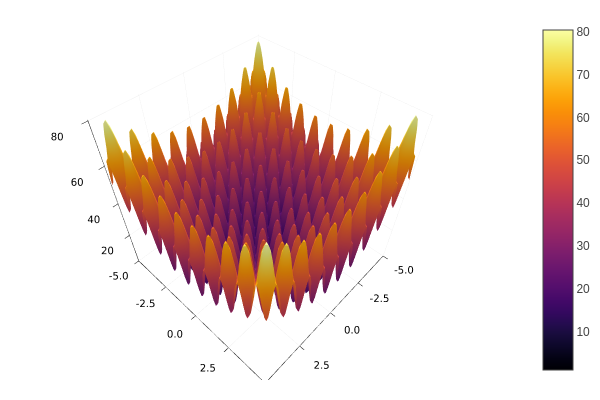

# Metaheuristics - an Intuitive Package for Global Optimization

**Author: Jesus Mejía (@jmejia8)**

High-performance algorithms for optimization coded purely in a high-performance language.

[](https://github.com/jmejia8/Metaheuristics.jl)
[](https://travis-ci.com/jmejia8/Metaheuristics.jl)
[](https://codecov.io/gh/jmejia8/Metaheuristics.jl)
[](https://zenodo.org/badge/latestdoi/108706706)
[](https://doi.org/10.21105/joss.04723)


## Introduction

Optimization is one of the most common tasks in the scientific and industrial field but
real-world problems require high-performance algorithms to optimize non-differentiable,
non-convex, discontinuous functions. Different metaheuristics algorithms have been
proposed to solve optimization problems but without strong assumptions about the objective
function.

This package implements state-of-the-art metaheuristics algorithms for global optimization.
The package aims to provide easy-to-use (and fast) metaheuristics for numerical
global optimization.

## Installation

Open the Julia (Julia 1.1 or Later) REPL and press `]` to open the Pkg prompt. To add this package, use the add command:

```
pkg> add Metaheuristics
```

Or, equivalently, via the `Pkg` API:

```julia
julia> import Pkg; Pkg.add("Metaheuristics")
```

## Quick Start

Assume you want to solve the following minimization problem.



Minimize:

$f(x) = 10D + \sum_{i=1}^{D}  x_i^2 - 10\cos(2\pi x_i)$

where $x\in[-5, 5]^{D}$, i.e., $-5 \leq x_i \leq 5$ for $i=1,\ldots,D$. $D$ is the
dimension number, assume $D=10$.

### Solution

Firstly, import the Metaheuristics package:

```julia
using Metaheuristics
```

Code the objective function:
```julia
f(x) = 10length(x) + sum( x.^2 - 10cos.(2π*x)  )
```

Instantiate the bounds, note that `bounds` should be a $2\times 10$ `Matrix` where
the first row corresponds to the lower bounds whilst the second row corresponds to the
upper bounds.

```julia
D = 10
bounds = [-5ones(D) 5ones(D)]'
```

Approximate the optimum using the function `optimize`.

```julia
result = optimize(f, bounds)
```

Optimize returns a `State` datatype which contains some information about the approximation.
For instance, you may use mainly two functions to obtain such an approximation.

```julia
@show minimum(result)
@show minimizer(result)
```


## Contents

```@contents
Pages = ["examples.md", "algorithms.md", "problems.md", "indicators.md", "mcdm.md", "visualization.md", "api.md"]
Depth = 2
```

## Related packages

- [Evolutionary.jl](https://github.com/wildart/Evolutionary.jl): Genetic algorithms, "Evolution" Strategies, among others.
- [GeneticAlgorithms.jl](https://github.com/WestleyArgentum/GeneticAlgorithms.jl): Genetic Algorithms
- [BlackBoxOptim.jl](https://github.com/robertfeldt/BlackBoxOptim.jl): Optimizers for black-box optimization (no information about the objective function).
- [NODAL.jl](https://github.com/phrb/NODAL.jl): Stochastic Local Search methods, such as Simulated Annealing and Tabu Search.
- [Other Packages.](https://www.juliaopt.org/packages/)


## How to cite?

Please cite the package using the bibtex entry 

```bibtex
@article{metaheuristics2022, 
  doi = {10.21105/joss.04723}, 
  url = {https://doi.org/10.21105/joss.04723}, 
  year = {2022}, 
  publisher = {The Open Journal}, 
  volume = {7}, 
  number = {78}, 
  pages = {4723}, 
  author = {Jesús-Adolfo Mejía-de-Dios and Efrén Mezura-Montes}, 
  title = {Metaheuristics: A Julia Package for Single- and Multi-Objective Optimization}, 
 journal = {Journal of Open Source Software} }
```

or the citation string 

Mejía-de-Dios et al., (2022). Metaheuristics: A Julia Package for Single- and Multi-Objective Optimization. Journal of Open Source Software, 7(78), 4723, https://doi.org/10.21105/joss.04723

in your scientific paper if you use `Metaherustics.jl`. 


## Acknowledgments

Jesús Mejía acknowledges support from the Mexican Council for Science and Technology (CONACyT) through a scholarship to pursue graduate studies at the University of Veracruz, MEXICO.
This allowed the development of `Metaheuristics.jl` from August 2018 to July 2022.

