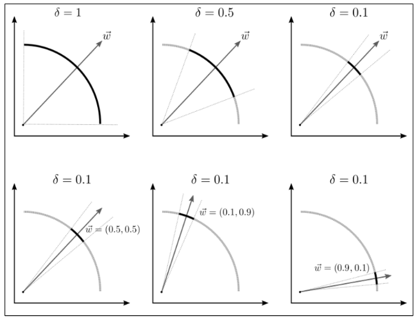

# Multi-Criteria Decision-Making 

A set of Multi-Criteria Decision Making (MCDM) methods is available in `Metaheuristics.jl`.

!!! compat "Maximization or Minimization"
    Here, minimization is always assumed.   

Firstly, it is recommended to read the details of the following two functions.

```@docs
decisionmaking
```


```@docs
best_alternative
```

Currently available methods are listed in the following table.

|     Method      | Strategies | Preferences | Dependency    | 
|-----------------|------------|-------------|---------------|
| [`CompromiseProgramming`](@ref) | S  | W/D         |               |
| [`ROIArchiving`](@ref)  |      M     | D           |               |
| `ArasMethod`    |      S     | W           | [JMcDM](@ref) |
| `CocosoMethod`  |      S     | W           | [JMcDM](@ref) |
| `CodasMethod`   |      S     | W           | [JMcDM](@ref) |
| `CoprasMethod`  |      S     | W           | [JMcDM](@ref) |
| `EdasMethod`    |      S     | W           | [JMcDM](@ref) |
| `ElectreMethod` |      M     | W           | [JMcDM](@ref) |
| `GreyMethod`    |      S     | W           | [JMcDM](@ref) |
| `MabacMethod`   |      S     | W           | [JMcDM](@ref) |
| `MaircaMethod`  |      S     | W           | [JMcDM](@ref) |
| `MooraMethod`   |      S     | W           | [JMcDM](@ref) |
| `SawMethod`     |      S     | W           | [JMcDM](@ref) |
| `TopsisMethod`  |      S     | W           | [JMcDM](@ref) |
| `VikorMethod`   |      S     | W           | [JMcDM](@ref) |
| `WPMMethod`     |      S     | W           | [JMcDM](@ref) |
| `WaspasMethod`  |      S     | W           | [JMcDM](@ref) |
| `MarcosMethod`  |      S     | W           | [JMcDM](@ref) |
| `ROVMethod`     |      S     | W           | [JMcDM](@ref) |

A **Method** can suggest Single (S) or Multiple (M) **Strategies**.
Also, Methods can represent **Preferences** by using weight vectors (W),
reference directions (D) or reference points (P).


## JMcDM


[JMcDM](https://github.com/jbytecode/JMcDM) is a package for MCDM developed by [Satman2021JMcDM](@cite).
Many methods have been implemented there, and many of them have been interfaced here.

The main method to use JMcDM within Metaheuristics is described as follows.

```julia
mcdm(data, w, method)
```

Perform selected `method` for a given `data` and weight vector `w`.
Here, `data` can be a set of non-dominated solutions (population), a [`State`](@ref) or a decision `Matrix`.

Also, `method` can be selected from [JMcDM](https://github.com/jbytecode/JMcDM) package.

Supported MCDM methods:

* `ArasMethod`
* `CocosoMethod`
* `CodasMethod`
* `CoprasMethod`
* `EdasMethod`
* `ElectreMethod`
* `GreyMethod`
* `MabacMethod`
* `MaircaMethod`
* `MooraMethod`
* `SawMethod`
* `TopsisMethod` **(default method)**
* `VikorMethod`
* `WPMMethod`
* `WaspasMethod`
* `MarcosMethod`
* `ROVMethod`

See the [JMcDM documentation](https://jbytecode.github.io/JMcDM/docs/build/mcdms/) for
more details about the methods.

### Example 1:

Performing MCDM using a population.

```julia-repl
julia> _, _, population = Metaheuristics.TestProblems.ZDT1();

julia> dm = mcdm(population, [0.5, 0.5], TopsisMethod());

julia> population[dm.bestIndex]
(f = [0.5353535353535354, 0.2683214262030523], g = [0.0], h = [0.0], x = [5.354e-01, 0.000e+00, …, 0.000e+00])
```

### Example 2:

Performing MCDM using results from metaheuristic.

```julia-repl
julia> f, bounds, _ = Metaheuristics.TestProblems.ZDT1();

julia> res = optimize(f, bounds, NSGA2());

julia> dm = mcdm(res, [0.5, 0.5], TopsisMethod());

julia> res.population[dm.bestIndex]
(f = [0.32301132058506055, 0.43208538139854685], g = [0.0], h = [0.0], x = [3.230e-01, 1.919e-04, …, 1.353e-04])
```

### Selecting best alternative

```julia
best_alternative(res, w, method)
```
Perform McDM using results from metaheuristic and return the best alternative in `res.population`.


```julia-repl
julia> f, bounds, _ = Metaheuristics.TestProblems.ZDT1();

julia> res = optimize(f, bounds, NSGA2());

julia> best_sol = best_alternative(res, [0.5, 0.5], TopsisMethod())
(f = [0.32301132058506055, 0.43208538139854685], g = [0.0], h = [0.0], x = [3.230e-01, 1.919e-04, …, 1.353e-04])
```


##  Region of Interest Archiving

[`ROIArchiving`](@ref) uses a set of reference directions to determine the areas of interest of the Pareto
Front and a set of thresholds associated with each component from the reference directions,
which determine the boundaries of the area of interest being covered. See 
[sebastian2022efficient](@cite).



```@docs
ROIArchiving
```

## Compromise Programming

More information about Compromise Programming
can be found in [Ringuest1992](@cite)

```@docs
CompromiseProgramming
```
