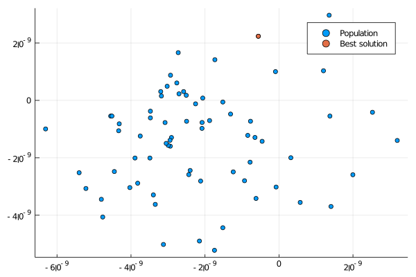
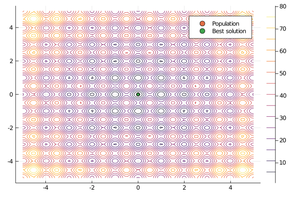
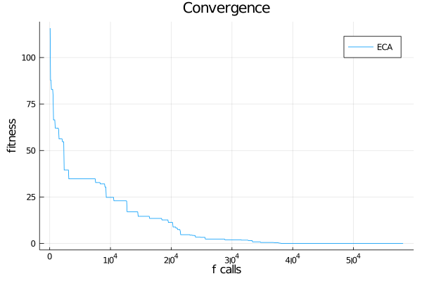

# Visualization


Present the results using fancy plots is an important part of solving optimization problems.
In this part, we use the [Plots.jl](http://docs.juliaplots.org/latest/) package which can be installed via de Pkg prompt within
Julia:

Type `]` and then:

```
pkg> add Plots
```

Or:

```
julia> import Pkg; Pkg.add("Plots")
```

Once Plots is installed on your Julia distribution, you will be able to reproduce the 
following examples.


Assume you want to solve the following minimization problem.


Minimize:

$f(x) = 10D + \sum_{i=1}^{D}  x_i^2 - 10\cos(2\pi x_i)$

where $x\in[-5, 5]^{D}$, i.e., $-5 \leq x_i \leq 5$ for $i=1,\ldots,D$. $D$ is the
dimension number, assume $D=10$.


## Population Distribution

Let's solve the above optimization problem and plot the resulting population (projecting
two specific dimensions).

```julia
using Metaheuristics
using Plots
gr()


# objective function
f(x) = 10length(x) + sum( x.^2 - 10cos.(2π*x)  )

# number of variables (dimension)
D = 10

# bounds
bounds = [-5ones(D) 5ones(D)]'

# Common options
options = Options(seed=1)

# Optimizing
result = optimize(f, bounds, ECA(options=options))

# positions in matrix NxD 
X = positions(result)

scatter(X[:,1], X[:,2], label="Population")

x = minimizer(result)
scatter!(x[1:1], x[2:2], label="Best solution")


# (optional) save figure
savefig("final-population.png")

```



If your optimization problem is scalable, then you also can plot level curves.
In this case, let's assume that $D=2$.


```julia
using Metaheuristics
using Plots
gr()


# objective function
f(x) = 10length(x) + sum( x.^2 - 10cos.(2π*x)  )

# number of variables (dimension)
D = 2

# bounds
bounds = [-5ones(D) 5ones(D)]'

# Common options
options = Options(seed=1)

# Optimizing
result = optimize(f, bounds, ECA(options=options))

# positions in matrix NxD 
X = positions(result)

xy = range(-5, 5, length=100)
contour(xy, xy, (a,b) -> f([a, b]))

scatter!(X[:,1], X[:,2], label="Population")

x = minimizer(result)
scatter!(x[1:1], x[2:2], label="Best solution")


# (optional) save figure
savefig("final-population-contour.png")
```




### Objective Function Values

Metaheuristics implements some methods to obtain the objective function values (fitness)
from the solutions in resulting population. One of the most useful method is [`fvals`](@ref).
In this case, let's use [`PSO`](@ref).

```julia
using Metaheuristics
using Plots
gr()


# objective function
f(x) = 10length(x) + sum( x.^2 - 10cos.(2π*x)  )

# number of variables (dimension)
D = 10

# bounds
bounds = [-5ones(D) 5ones(D)]'

# Common options
options = Options(seed=1)

# Optimizing
result = optimize(f, bounds, PSO(options=options))

f_values = fvals(result)
plot(f_values)

# (optional) save figure
savefig("fvals.png")
```


## Convergence

Sometimes, it is useful to plot the convergence plot at the end of the optimization process.
To do that, it is necessary to set `store_convergence = true` in [`Options`](@ref).
Metaheuristics implements a method called [`convergence`](@ref).

```julia
using Metaheuristics
using Plots
gr()


# objective function
f(x) = 10length(x) + sum( x.^2 - 10cos.(2π*x)  )

# number of variables (dimension)
D = 10

# bounds
bounds = [-5ones(D) 5ones(D)]'

# Common options
options = Options(seed=1, store_convergence = true)

# Optimizing
result = optimize(f, bounds, ECA(options=options))

f_calls, best_f_value = convergence(result)

plot(xlabel="f calls", ylabel="fitness", title="Convergence")
plot!(f_calls, best_f_value, label="ECA")

# (optional) save figure
savefig("convergence.png")
```



## Animate convergence

Also, you can plot the population and convergence in the same figure.


### Single-Objective Problem

```julia
using Metaheuristics
using Plots
gr()


# objective function
f(x) = 10length(x) + sum( x.^2 - 10cos.(2π*x)  )

# number of variables (dimension)
D = 10

# bounds
bounds = [-5ones(D) 5ones(D)]'

# Common options
options = Options(seed=1, store_convergence = true)

# Optimizing
result = optimize(f, bounds, ECA(options=options))

f_calls, best_f_value = convergence(result)

animation = @animate for i in 1:length(result.convergence)
    l = @layout [a b]
    p = plot( layout=l)

    X = positions(result.convergence[i])
    scatter!(p[1], X[:,1], X[:,2], label="", xlim=(-5, 5), ylim=(-5,5), title="Population")
    x = minimizer(result.convergence[i])
    scatter!(p[1], x[1:1], x[2:2], label="")

    # convergence
    plot!(p[2], xlabel="Generation", ylabel="fitness", title="Gen: $i")
    plot!(p[2], 1:length(best_f_value), best_f_value, label=false)
    plot!(p[2], 1:i, best_f_value[1:i], lw=3, label=false)
    x = minimizer(result.convergence[i])
    scatter!(p[2], [i], [minimum(result.convergence[i])], label=false)
end

# save in different formats
# gif(animation, "anim-convergence.gif", fps=30)
mp4(animation, "anim-convergence.mp4", fps=30)

```


### Multi-Objective Problem


```julia
import Metaheuristics: optimize, SMS_EMOA, TestProblems, pareto_front, Options
import Metaheuristics.PerformanceIndicators: Δₚ
using Plots; gr()

# get test function
f, bounds, pf = TestProblems.ZDT6();

# optimize using SMS-EMOA
result = optimize(f, bounds, SMS_EMOA(N=70,options=Options(iterations=500,seed=0, store_convergence=true)))

# true pareto front
B = pareto_front(pf)
# error to the true front
err = [ Δₚ(r.population, pf) for r in result.convergence]
# generate plots
a = @animate for i in 1:5:length(result.convergence)
    A = pareto_front(result.convergence[i])

    p = plot(B[:, 1], B[:,2], label="True Pareto Front", lw=2,layout=(1,2), size=(850, 400))
    scatter!(p[1], A[:, 1], A[:,2], label="SMS-EMOA", markersize=4, color=:black, title="ZDT6")
    plot!(p[2], eachindex(err), err, ylabel="Δₚ", legend=false)
    plot!(p[2], 1:i, err[1:i], title="Generation $i")
    scatter!(p[2], [i], err[i:i])
end

# save animation
gif(a, "ZDT6.gif", fps=20)
```


## Pareto Front


```julia
import Metaheuristics: optimize, NSGA2, TestProblems, pareto_front, Options
using Plots; gr()

f, bounds, solutions = TestProblems.ZDT3();

result = optimize(f, bounds, NSGA2(options=Options(seed=0)))

A = pareto_front(result)
B = pareto_front(solutions)

scatter(A[:, 1], A[:,2], label="NSGA-II")
plot!(B[:, 1], B[:,2], label="Parento Front", lw=2)
savefig("pareto.png")
```


## Live Plotting

The [`optimize`](@ref) function has a keyword parameter named `logger` that contains
a function pointer. Such function will receive the [`State`](@ref) at the end of each
iteration in the main optimization loop.

```julia
import Metaheuristics: optimize, NSGA2, TestProblems, pareto_front, Options, fvals
using Plots; gr()

f, bounds, solutions = TestProblems.ZDT3();
pf = pareto_front(solutions)

logger(st) = begin
    A = fvals(st)
    scatter(A[:, 1], A[:,2], label="NSGA-II", title="Gen: $(st.iteration)")
    plot!(pf[:, 1], pf[:,2], label="Parento Front", lw=2)
    gui()
    sleep(0.1)
end

result = optimize(f, bounds, NSGA2(options=Options(seed=0)), logger=logger)

```

